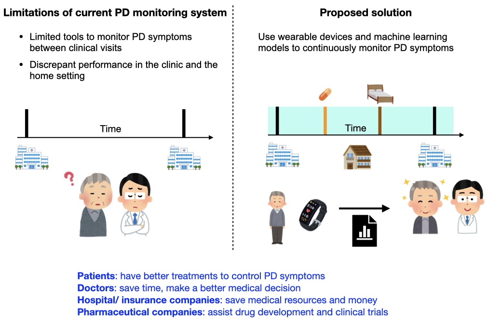

# Digital Biomarkers for Parkinson’s Disease 
Parkinson’s disease (PD) is a progressive neurodegenerative disorder affecting approximately one million Americans. Despite the prevalence of PD, the diagnosis and long-term monitoring of this disease is limited and subjective, mainly assessed via clinical observations and patients’ descriptions. Recent advances in digital health approaches such as wearables, phones, and smartwatches provide opportunities to collect rich and objective real-word data. In the JHU Data Science Fellows Program, my goal is to identify sets of digital biomarkers for PD using MJFF Levodopa Wearable Sensors Dataset. 

 
## Data 
The dataset is from the Levodopa Response Study supported by Michael J, Fox Foundation. In this dataset, 28 PD patients were included. These patients wore a smartwatch (accelerometer) on the wrist of the most affected limb and performed a series of tasks realted to activity of daily living such as standing, sitting, walking, opening a bottle and pouring water, drawing and writing on a paper, and typing on a computer keyboard. During each task, a trained clinician rated three PD symptoms: tremor (0-4 ranges), dyskinesia (involuntary, erratic, writhing movements, presence/absence), and bradykinesia (slowness of movement, presence/absence). Additionally, demographics and clinical data was collected.

## Model training and evaluation

#### Data exploration and preparation
There are approximately seven thousands samples from 28 subjects in this dataset. It was splitted into train (3701 samples from 15 subjects), validation (1480 samples from 6 subjects), test (1728 samples from 7 subjects) datasets. The distributions of scores for each symptoms were not balanced. I first reduced the number of categories of tremor (no: score 0, mild: score 1 and 2, sever: score 3 and 4). I then balanced the datastes via upsampling.

#### Feature extraction and slection
I extracted 2262 sensor features including mean, sum of changes, autocorrelation using tsfresh and 69 clinical features including gender, age, tremor history, and sleep disruption. I then removed features with zero variance, and used univariate selection as well as PCA to select 20 sensor and 4 clinical features. 
 
#### Model evaluation
I tested basic classifiers including Logistic Regression, Random Forest, Support Vector Machine, Naive Bayes. Since I didn't want to miss a prediction of PD symptoms, I set a target recall for class 1. Then, I chose the classifiers based on the F1 scores.  

## Model deployment and future direction
I deployed the models using AWS SageMaker endpoint, Lambda, and API Gateway and tested it in the Postman. 

In the future, we can build and deploy an inference pipeline to track PD symptoms in the home setting. This information is important for doctors to assess the progression of PD and to make a medical decision.

**Proposed pipeline**\

**Example prediction**\

**Example report**\

## Reference
1. Daneault, J.-F., Vergara-Diaz, G., Parisi, F., Admati, C., Alfonso, C., Bertoli, M., Bonizzoni, E., Carvalho, G.F., Costante, G., Fabara, E.E., et al. (2021). Accelerometer data collected with a minimum set of wearable sensors from subjects with Parkinson’s disease. Sci Data 8, 48. (https://www.nature.com/articles/s41597-021-00830-0).

2.  Christ, M., Braun, N., Neuffer, J., and Kempa-Liehr, A.W. (2018). Time Series FeatuRe Extraction on basis of Scalable Hypothesis tests (tsfresh – A Python package). Neurocomputing 307, 72–77. (https://doi.org/10.1016/j.neucom.2018.03.067).

## Acknowledgement
I want to thank my mentor, Ellen Ambrose, whose unwavering guidance significantly contributed to the success of this project. I would also like to express my appreciation to Pat Phelps at the JHU career office for invaluable support, as well as to the dedicated instructors—Eric Finkel, Alberto Hernandez, and Liang Chen—for their efforts in organizing the Data Science Fellows Program. Finally, my thanks go to all the alumni mentors who generously shared their experiences and provided valuable feedback.